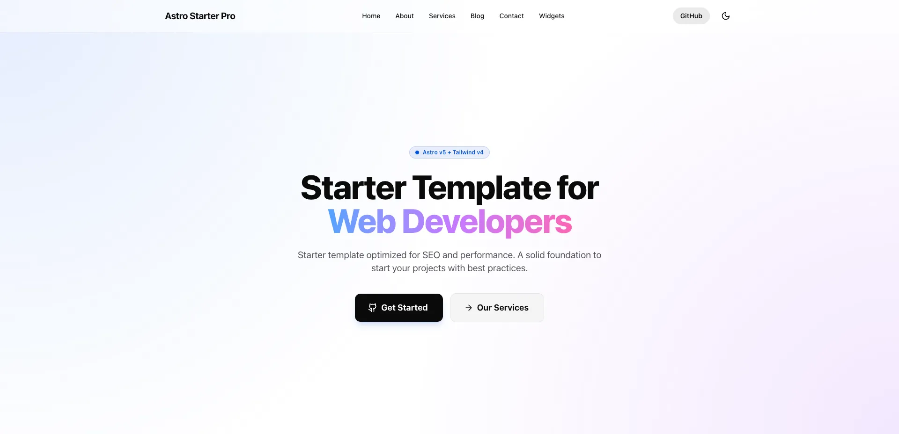

# 🚀 Astro Starter Pro

**Astro Starter Pro** is a professional, open-source template for building fast websites using **[Astro 5](https://astro.build/) + [Tailwind CSS 4](https://tailwindcss.com/)**. Designed with industry best practices, optimized SEO, and a modern development experience.

<br>

[](https://github.com/devgelo-labs/astro-starter-pro)
[](https://github.com/devgelo-labs/astro-starter-pro)
[](./LICENSE)
[](https://astro.build/)
[](https://tailwindcss.com/)
[](https://github.com/devgelo-labs)

<br>

<details open>
<summary>Table of Contents</summary>

- [Demo](#demo)
- [Features](#features)
- [Tech Stack](#tech-stack)
- [Project Structure](#project-structure)
- [Quick Start](#quick-start)
- [Configuration](#configuration)
- [Content Management](#content-management)
- [Commands](#commands)
- [Support the Project](#support-the-project)
- [License](#license)

</details>

<br>

## Demo

📌 [https://astrostarterpro.com/](https://astrostarterpro.com/)

## Features

- ✅ **Dark & Light Mode**: Clean implementation.
- ✅ **Optimized SEO**: Automatic meta tags, Structured Data (JSON-LD), RSS Feed, Open Graph, Twitter Cards, and native Sitemap.
- ✅ **Native Scroll Animations**: High-performance, JS-light scroll reveal animations using `Intersection Observer`.
- ✅ **Clean Architecture**: Organized and scalable code.
- ✅ **Reusable Components**: Navbar, Footer, and modern Layouts with Tailwind v4.

<br>



<br>


<br>

## Tech Stack

This template is built with modern, high-performance technologies:

- **[Astro 5](https://astro.build/)**: The web framework for building content-driven websites.
- **[Tailwind CSS 4](https://tailwindcss.com/)**: A utility-first CSS framework for rapid UI development.
- **[TypeScript](https://www.typescriptlang.org/)**: Strongly typed programming language that builds on JavaScript.
- **[MDX](https://mdxjs.com/)**: Markdown for the component era, allowing you to use JSX in your markdown content.

<br>

## Project Structure

A quick overview of the folder structure to help you understand where everything is located:

```text
/
├── public/                # Static assets (fonts, favicon, images outside of processing)
├── src/
│   ├── assets/            # Images and assets to be processed by Astro
│   ├── components/        # Reusable UI components (Navbar, Footer, SEO, etc.)
│   ├── config/            # Centralized site configuration (site.ts)
│   ├── content/           # Blog posts and content collections (Markdown/MDX)
│   ├── layouts/           # Base page layouts
│   ├── pages/             # File-based routing (pages and endpoints)
│   ├── styles/            # Global CSS and Tailwind directives
│   ├── types/             # TypeScript type definitions
│   └── content.config.ts  # Astro Content Collections configuration
├── astro.config.mjs       # Astro configuration file
└── tailwind.config.mjs    # Tailwind CSS configuration
```

<br>

## Quick Start

To start with this project locally, clone the repository and install dependencies:

```bash
# Clone the repository
git clone https://github.com/devgelo-labs/astro-starter-pro.git

# If you like it, don't forget to leave a star! ⭐
cd astro-starter-pro
npm install
npm run dev
```

<br>

## Configuration

All global site information is managed in `src/config/site.ts`. Update this file with your data:

```typescript
// src/config/site.ts
import ogImage from "../assets/og-image.png";

export const siteConfig = {
  name: "Astro Starter Pro",
  description:
    "Starter template optimized for SEO and performance. A solid foundation to start your projects with best practices.",
  url: "https://astrostarterpro.com",
  lang: "en",
  locale: "en_US",
  author: "Devgelo",
  twitter: "@Devgelo",
  ogImage: ogImage,
  socialLinks: {
    twitter: "https://twitter.com",
    github: "https://github.com/devgelo-labs/astro-starter-pro",
    discord: "https://discord.com",
  },
  navLinks: [
    { text: "Home", href: "/" },
    { text: "About", href: "/about" },
    { text: "Services", href: "/services" },
    { text: "Blog", href: "/blog" },
    { text: "Contact", href: "/contact" },
    { text: "Widgets", href: "/widgets" },
  ],
};
```

## Content Management

This template uses **Astro Content Collections** to manage blog posts.

To add a new blog post, simply create a new `.md` or `.mdx` file inside the `src/content/blog/` directory.

### Frontmatter Schema

Each blog post must include the following frontmatter at the top of the file:

```yaml
---
title: "Your Post Title"
description: "A brief summary of your post for SEO."
pubDate: 2024-03-20
author: "Author Name"
image: "/images/your-cover-image.webp" # Optional
tags: ["Astro", "Tailwind"] # Optional
category: "Web Development" # Optional
---
Your markdown or MDX content goes here...
```

<br>

## Commands

| Command             | Action                                             |
| :------------------ | :------------------------------------------------- |
| `npm run dev`       | Starts the development server at `localhost:4321`. |
| `npm run build`     | Generates the static site in the `dist/` folder.   |
| `npm run preview`   | Previews the production build locally.             |
| `npm run lint`      | Runs ESLint to ensure code quality.                |
| `npm run format`    | Formats code with Prettier.                        |
| `npm run fix`       | Runs format and lint auto-fix.                     |
| `npm run check`     | Runs astro check for diagnostics.                  |
| `npm run typecheck` | Verifies TypeScript types.                         |

<br>

## Support the Project

If you find this starter useful, please consider giving it a ⭐ on GitHub! It helps more people discover the project.

<br>

## License

This project is under the **MIT** license. See the [LICENSE](./LICENSE) file for more details.

---

Designed by [Devgelo Labs](https://github.com/devgelo-labs)
